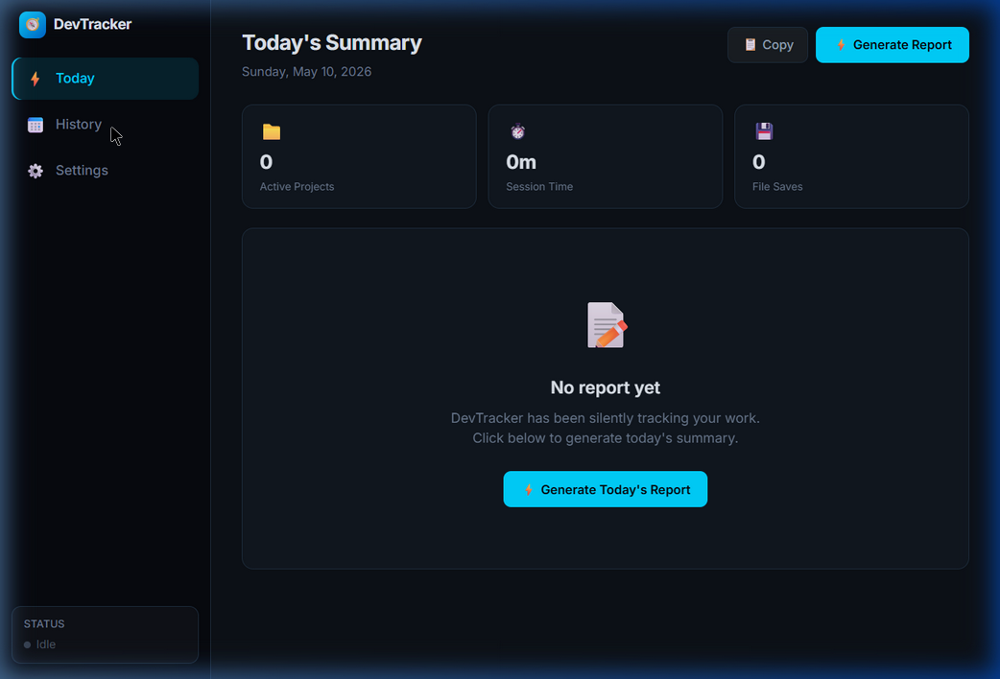
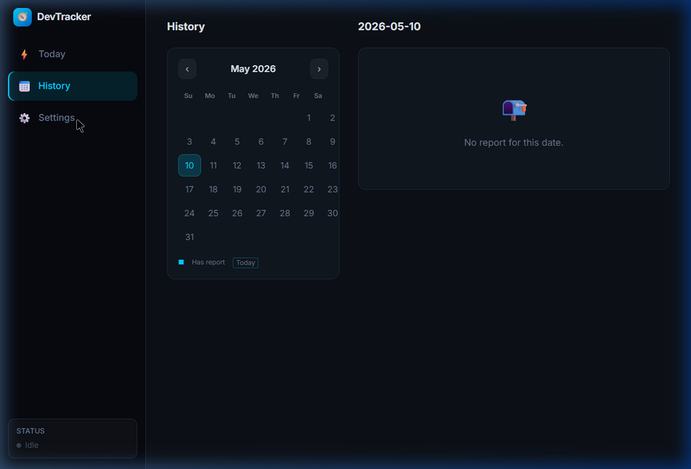
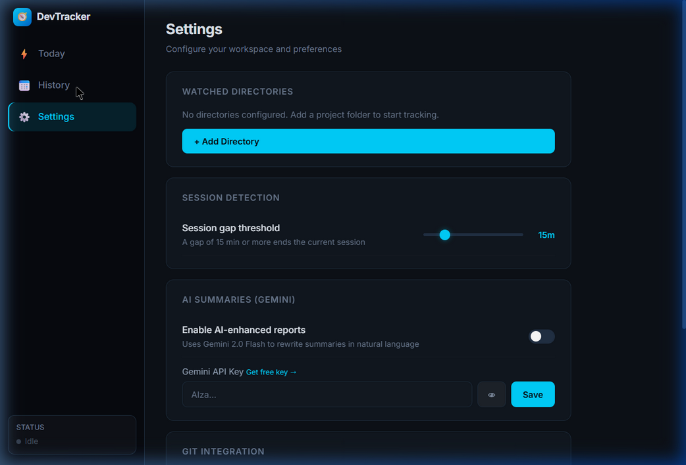

# DevTracker 🧭

DevTracker is a zero-telemetry, local-first Electron desktop application that acts as an automated coding assistant. It silently tracks your engineering sessions in the background, pulls your Git commits, and generates AI-enhanced daily standup reports.



## ✨ Features

- **Invisible Local Tracking**: Uses `chokidar` to monitor configured project directories and intelligently groups your coding activity into "sessions" based on idle thresholds.
- **Git Integration**: Automatically polls your active repositories every 30 minutes, fetching local commits and attributing them to specific coding sessions.
- **AI-Enhanced Summaries**: Employs Google's Gemini API to automatically rewrite raw timeline data into professional, natural-language daily standup reports.
- **100% Local Storage**: Uses a pure WebAssembly SQLite implementation (`sql.js`) to persist all data locally on your disk. No cloud telemetry, no central servers.
- **Modern Desktop Shell**: Built on Electron 33 and React 18, featuring a sleek, dark-mode glassmorphic UI and a system tray icon.

## 📸 Screenshots

### History View
Browse your past coding days and read historic reports easily using the built-in calendar view.


### Settings & Configuration
Configure watched repositories, adjust session idle time, and manage your Gemini AI integration directly within the app.


## 🚀 Getting Started

### Prerequisites
- Node.js v18 or higher
- Git

### Installation

1. Clone the repository:
   ```bash
   git clone https://github.com/towhaEL/devTracker.git
   cd devTracker
   ```

2. Install dependencies:
   ```bash
   npm install
   ```

3. Start the development server:
   ```bash
   npm run dev
   ```

### Building for Production
To package the app into a standalone Windows `.exe` installer:
```bash
npm run dist
```
The resulting installer will be available in the `release/` directory.

## 🛠️ Technology Stack
- **Desktop Runtime**: Electron
- **Frontend Framework**: React 18, Vite
- **Styling**: Tailwind CSS
- **Database**: SQLite (`sql.js` WASM)
- **AI Integration**: Google Generative AI (Gemini Flash)
- **File System**: Chokidar
- **Git Handling**: Simple-Git

## 🔒 Privacy First
DevTracker is designed with strict privacy in mind. There is absolutely no telemetry, usage tracking, or cloud syncing. Unless you explicitly enable the Gemini AI integration (which only sends your raw activity timeline directly to Google's API for processing), your data never leaves your machine.
